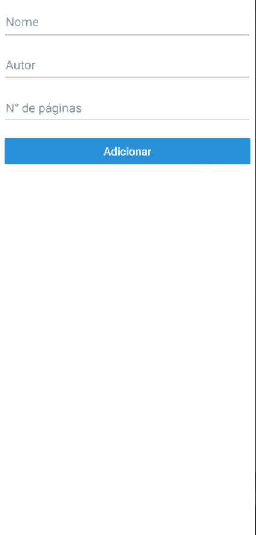
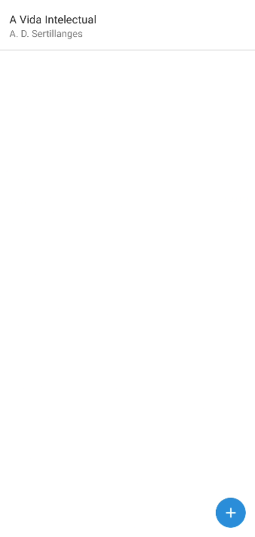
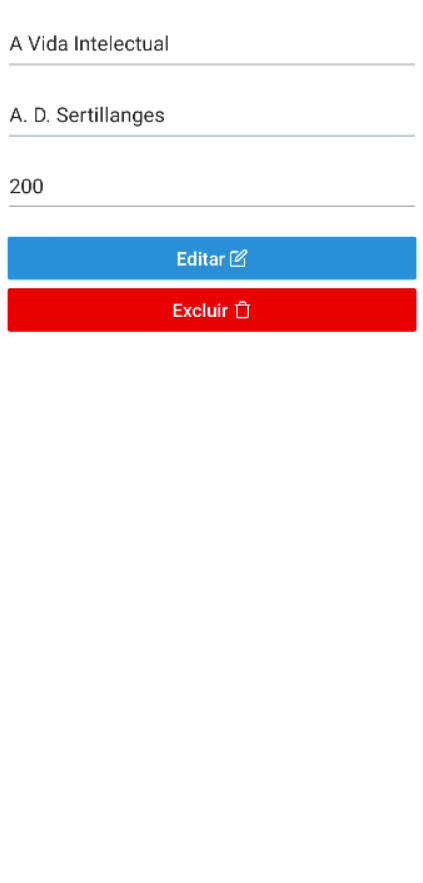

# Seja Bem-Vindo ao BookTracker

Integrantes:

- Felipe Bastos Xavier
- 312181015

<h3 align="center">NPM</h3>

- npm i react-navigation-stack
- npm i @react-navigation/native
- npm i react-native-screens
- npm i react-native-elements
- npm i firebase
- npm i validate.js

<h3 align="center">Inicializar</h3>

- npm install
- expo install
- expo start

<h2 align="center">Página Inicial</h2>

  

<h2 align="center">Listagem de livros vazia</h2>

  

<h2 align="center">Criação de livros vazia</h2>

  

<h2 align="center">Criação de livros preenchida</h2>

  

<h2 align="center">Listagem de livros preenchida</h2>

  

<h2 align="center">Edição de livros</h2>

  

